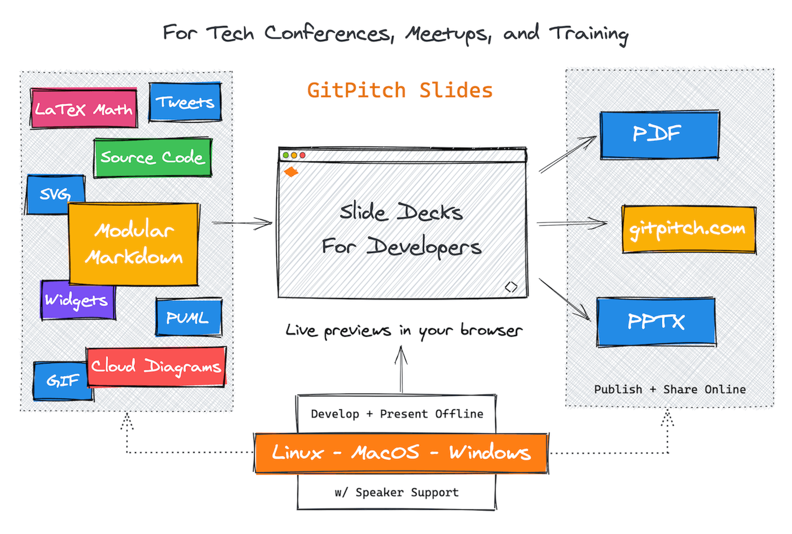

@md[title=GitPitch](assets/md/splash.md)

[drag=10 10, drop=-25 60, opacity=0.7, set=h2-silver fragment, fit=1, animate=bouncedown, filter=contrast]

## 4.0

[drag=100 20, drop=bottom]
Markdown Slide Decks

---

[drag=100 15, drop=top, fit=0.9, bg=#0074D9, set=h2-white, fit=0.6]

## The Perfect Slide Deck Solution

[drag=100, drop=center, fit=0.65]

## For Tech Conferences, Training, Developer Advocates, and Educators.

[drag=100 25, drop=bottom, bg=assets/img/crowd.png]

---

[drag=100 15, drop=top, fit=0.9, bg=#0074D9, set=h2-white, fit=0.6]

## A Git Native Slide Deck Solution

[drag=100 85, drop=0 15, fit=1.5, flow=row, animate=speedright]

# @fab[gitlab]
# @fab[github fa-lg]
# @fab[bitbucket]

[drag=90 12, drop=4 -0, flow=row true]

Manage decks as code
Modular Markdown
Git-push to publish

---

[drag=100, bg=assets/img/laptop.jpg 0.4 black]

[drag=100 15, drop=0 0, set=text-white]

Introducing features at the @fa[heart text-black text-20] of

[drag=5 15, drop=-630px 2, set=text-white, fit=1.5, animate=tada]

@fa[heart text-blue]

[drag=100 40, drop=bottom, set=h1-white]

# GitPitch 4.0

---

[drag=100, bg=assets/img/grid-on-grid.png]

---

[drag=100, bg=assets/img/layouts-on-grid.png]

---
[drag=100 15, drop=top, bg=#0074D9, set=h2-white, fit=0.6]
## Enjoy the layout precision of traditional

[drag=80 50, drop=center, fit=0.65]

# Drag-and-Drop Presentation Tools

[drag=100 15, drop=bottom, fit=0.9, bg=#0074D9, set=h2-white, fit=0.6]
## Like PowerPoint, Keynote, and Google Slides

---

[drag=100, drop=center, bg=#0074D9, set=h2-white, fit=0.95]

## Directly within the MARKDOWN for your GitPitch slide decks.

[drag=100, drop=50 -20 true true, set=blue-faded, fit=6]

@fa[heart]

[drag=20, drop=-10 20, set=blue-faded, fit=4]

@fa[heart]

[drag=26 40, drop=0, set=blue-faded, fit=8.5]

@fa[heart]

[drag=10 15, drop=-5, set=blue-faded, fit=3]

@fab[markdown]

---

[drag=40 50, drop=center, bg=#FF4136, set=h2-white, fit=1.25]

## Your Slide Content Can Be...

---

[drag=100 50, drop=top, bg=#0074D9, set=h2-white, fit=3.3]

## DRAGGED

[drag=100 10, drop=bottom]
To Size

---

[drag=100 50, drop=0 25, bg=#3D9970, set=h2-white, fit=3.3, animate=slidedown faster]

## DROPPED

[drag=100 10, drop=bottom]
To Position

---

[drag=100 10, drop=top, set=front-9 text-white]
And

[drag=100, drop=center, bg=#FF4136, set=h2-white, fit=9.99]

## FIT

[drag=100 10, drop=bottom, set=text-white]
To Scale
---
[drag=100, drop=0, bg=#0074D9] 

[drag=100 15, drop=top, bg=#0074D9, set=text-white]

With

[drag=100 50, drop=center, set=h1-white front-9, fit=1.2]

# Pixel-perfect Accuracy @fa[crosshairs]

[drag=100 15, drop=bottom, bg=#0074D9, set=text-white]

Directly within your Slide Markdown
---
[drag=100, drop=0, bg=assets/img/fireworks.gif 0.4 black]
[drag=450px, drop=10, border=6px solid white]

[drag=450px, drop=50 -10 true false, border=6px solid white, filter=contrast, rotate=-10]

[drag=300px, drop=10 -10, stretch=true, border=6px solid white, filter=blur]

[drag=300px, drop=50 10 true false, stretch=true, border=6px solid white, rotate=10]

---

---

[drag=25 60, drop=center, bg=#0074D9, set=text-white, fit=1.5, rotate=10]

@ul[list-spaced-bullets](false)
- Lorem
- Ipsum
- Dolor
- Sit Amet
@ul

---

[drag=40 100, drop=left, bg=#FF4136, set=text-white, fit=2.4]

@ul[list-spaced-bullets list-square-bullets](false)
- Lorem
- Ipsum
- Dolor
- Sit Amet
@ul

---

[drag=30 50, drop=2 28, bg=#0074D9, set=text-white back-9, fit=1.2, font=righteous, rotate=-5]

@ul[list-spaced-bullets list-square-bullets list-fade-bullets, sync=true]
- Sync
- Across
- And
- Just like
@ul

[drag=40 80, drop=30 10, bg=#232B2B, flow=stack, sync=true, border=6px solid #276248, set=rounded text-white]

@math[fit=1.4]
$\sum_{i=0}^n i^2 = \frac{(n^2+n)(2n+1)}{6}$
@math

[drag=40 20, drop=30 10, set=h2-white, fit=0.5]

## Slide Synchronization

[drag=30 50, drop=-2 28, bg=#FF4136, set=text-white back-9, fit=1.2, font=bubblegum, rotate=5]

@ul[list-spaced-bullets list-roman-bullets, sync=true]
- Content
- Lists
- Stacks
- This @fa[smile]
@ul

[drag=40 10, drop=50 -20 true true, set=text-white text-bold text-smallcaps, font=montserrat]

@ul[list-squash-bullets, sync=true]
- Image Content
- Math Formulas
- Excalidraw Sketches
- Video Embeds and more...
@ul

---
[drag=50 10, drop=0 5, set=front-9]
Diagrams-as-Code

@cloud[drag=50 100, drop=0](src/demo.py)

@mermaid[drag=55 100, drop=right, width=1200, theme=forest](src/demo.mmd)

[drag=50 10, drop=0 -5, set=front-9]
Mermaid Flowcharts
---

[drag=100 10, drop=top, set=front-9]
PlantUML Diagrams

@plantuml[drop=left, pad=30px, width=1000px](src/graph-1.puml)

@plantuml[drop=topright, pad=10px, width=500px](src/graph-2.puml)

[drop=bottomright, pad=10px, width=500px]

<canvas data-chart="line">
<!--
{
 "data": {
  "labels": ["January"," February"," March"," April"," May"," June"," July"],
  "datasets": [
   {
    "data":[65,59,80,81,56,55,40],
    "label":"Sample Data X",
    "backgroundColor":"rgba(20,220,220,.8)"
   },
   {
    "data":[28,48,40,19,86,27,90],
    "label":"Sample Data Y",
    "backgroundColor":"rgba(120,220,0,.8)"
   }
  ]
 },
 "options": { "responsive": "true" }
}
-->
</canvas>

---

[drag=100, drop=center, bg=#0074D9, set=text-white, fit=9.9]

@math
`$\sum_{m} \sum_{d}$`
@math

---

[drag=100 100, drop=center, bg=#FF4136, set=text-white]

@math[drag=100 50, pad=30px, rotate=-20, fit=2.2]
`\[
\left( \sum_{k=22}^n a_k b_k \right)^{\!\!2} \leq
 \left( \sum_{k=1}^n a_k^2 \right) \left( \sum_{k=1}^n b_k^2 \right)
\]`
@math

---

[drag=55 100, drop=0, bg=black]

[drag=500px 50, drop=-8 25, border=10px solid black, rotate=5]

@tweet[https://twitter.com/gitpitch/status/1265627223610056707]

---

@code[drag=98, drop=1, fit=1.45, set=front-2, elixir](src/demo.ex)

[drag=50 6, drop=-2 1, flow=false, set=front-3 font-concert-one pull-right]

@[1-4](Live code presenting with optional annotations.)
@[6,12]
@[7-8]
@[7-9]
@[7-10]
@[7-11]

---
[drag=100, drop=center, bg=#0C0C0C]

[drag=100 45, drop=0 5, set=h1-white, fit=1.4]

# GitPitch 4.0

[drag=100 30, drop=0 50, fit=0.8, set=fragment, bg=#FF4136, set=h2-white, animate=bouncedown]

## Rewrites the rule book for markdown presentation solutions.

---
[drag=100, bg=#0C0C0C]
[drag=100 45, drop=0 5, fit=1.4, set=h1-white]

# GitPitch 4.0

[drag=100 50, drop=0 50, fit=0.8, bg=#0074D9, set=h1-white h3-white]

### To learn more visit
# gitpitch.com
